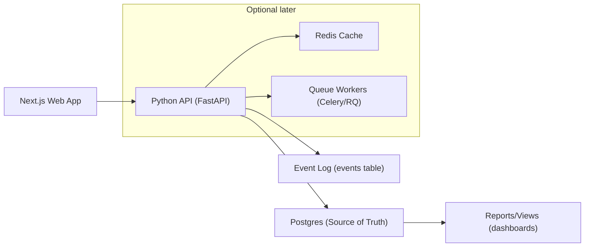

```mermaid
flowchart LR
  A["Factory: Produce items (~10k/day)"] --> B["Inbound to Dairy / Staging"]
  B --> C["Warehouses (20): receive & store"]
  C --> D["Retailers (2000+): place replenishment orders"]
  D --> E["Order allocation (inventory reserved)"]
  E --> F["Trip planning (cluster + assign vehicle/driver)"]
  F --> G["Dispatch trip (schedule + route + stops)"]
  G --> H["Driver executes (enroute/arrived/delivered)"]
  H --> I["POD captured (delivered/partial/failed)"]
  I --> J["Inventory + costs + KPIs updated"]
  J --> K["Reports/analytics + exception follow-ups"]
```

# Getto — A solution for supply chain (System Architecture)

## Overview
In Mira Bhayandar, poor coordination between logistics stakeholders and transport/delivery/supply chain causes repeated trips, traffic congestion, higher pollution, and low efficiency. The core issue is the lack of shared operational data and workflows across the supply chain.

**Supply chain in scope**
- Manufacturers Unit (1 Factory) → Amul Dairy → ~10,000 items/day
- Distributors Warehouses (Kandivali West + Kandivali East + Bandra; ~20 warehouses)
- Retailers Stores (2000+ stores; e.g., GADA Electronics)
- Consumers Home (if home delivery is part of the operating model)

**Distribution Transport Department in scope**
- Vehicles (100+)
- Drivers (100+)
- Routes (100+)
- Schedules (100+)
- Costs (100+)

**Target technologies**
- PostgresDB (SQL)
- Python (API/Backend)
- Next.js (Web App)

> Hard truth: “a shared platform” alone is not a solution. Without clear governance, role-based access, and incentives, stakeholders will withhold data. The architecture must enforce roles, permissions, and operational workflows that reduce friction and prevent gaming.

---

## 1) Business Logic (primary focus)

### 1.1 Actors / stakeholders
- **Factory Ops**: production + outbound to dairy
- **Dairy Ops**: receiving + staging
- **Warehouse Manager**: inventory + picking + outbound
- **Dispatcher / Transport Planner**: trip planning, routing, assignment
- **Driver**: execution + proof-of-delivery
- **Retailer**: demand / replenishment orders + delivery tracking
- **Customer/Consumer**: delivery recipient (only if home delivery is supported)
- **Admin / Compliance**: user management, permissions, audit

### 1.2 Core domain objects
- **SKU / Item**: product catalog units
- **Batch / Lot**: production group (date, quantity)
- **Location**: factory, dairy, warehouse, retailer, customer
- **Inventory**: on-hand, reserved, available, damaged/returned
- **Order**: replenishment / transfer / delivery request
- **Trip / Shipment**: vehicle run containing multiple stops
- **Stop**: a delivery/receipt point in a trip (warehouse/retailer/customer)
- **POD**: proof-of-delivery and exception reasons
- **Costs**: fuel, tolls, labor, maintenance (posted per trip/stop)

---

### 1.3 Use cases (mandatory)
- **UC1**: Retailer creates replenishment order (SKU, qty, time window)
- **UC2**: Warehouse allocates inventory (reserve stock per order line)
- **UC3**: Trip planning (cluster orders, assign vehicle/driver, sequence stops)
- **UC4**: Dispatch trip (lock plan, generate route sheet, schedule)
- **UC5**: Delivery execution (status updates, deliver/partial/failed)
- **UC6**: POD capture (signature/photo metadata, delivered qty, reason codes)
- **UC7**: Exceptions handling (delay, rejection, stockout, breakdown, reattempt)
- **UC8**: Inter-warehouse transfer (rebalance inventory)
- **UC9**: Cost tracking (per trip / per stop / per km / per item)
- **UC10**: Reports & analytics (service level, utilization, repeat trips, CO₂ proxy)

---

### 1.4 Flow chart / system flow (mandatory)

---

### 1.5 Business processes (mandatory)

#### Process P1 — Replenishment (Retailer → Warehouse)
1. Retailer creates replenishment order (SKU, quantity, time window, priority)
2. Warehouse validates and allocates inventory (reserve)
3. Warehouse creates picklist; items get picked/packed
4. Orders become “ready to ship”

#### Process P2 — Trip planning & dispatch (Transport Dept)
1. Dispatcher selects “ready to ship” orders
2. System clusters orders by geography + time window + vehicle constraints
3. System proposes trips (stops, sequence, ETAs); dispatcher reviews/edits
4. Assign vehicle + driver; publish route sheet
5. Dispatch trip and start monitoring

#### Process P3 — Delivery execution (Driver)
1. Start trip → navigate to stop sequence
2. Stop: arrive → unload/deliver → capture POD
3. Handle exceptions: partial, rejected, customer not available, damage
4. End trip; return undelivered items if required

#### Process P4 — Inventory reconciliation
1. Confirm shipped quantities (picked → shipped)
2. Confirm delivered quantities (shipped → delivered)
3. Process returns/damage adjustments with approval + reason codes

---

### 1.6 Business events (mandatory)
Events enable coordination, analytics, and auditability:
- `ProductionRecorded`
- `InboundReceived`
- `InventoryAdjusted`
- `OrderCreated`
- `OrderAllocated`
- `PicklistGenerated`
- `TripPlanned`
- `TripDispatched`
- `StopArrived`
- `DeliveryCompleted`
- `DeliveryFailed`
- `PODCaptured`
- `ReturnCreated`
- `CostPosted`

---

### 1.7 Business transactions (mandatory)
Atomic operations that must be consistent (DB transactions):
- **T1 Allocate inventory**: reserve stock per order line (avoid double allocation)
- **T2 Confirm picking**: reserved → picked/shipped (with quantity validation)
- **T3 Dispatch trip**: lock trip plan + vehicle/driver assignments
- **T4 Deliver stop**: persist POD, delivered qty, exceptions; update inventory movement
- **T5 Exception resolution**: reattempt, reroute, return-to-warehouse, credits
- **T6 Cost posting**: allocate costs to trip + stops; prevent double posting

---

### 1.8 Business reports (good to have)
- On-time delivery % (by warehouse/route/driver/retailer)
- Vehicle utilization (stops/day, km/day, capacity used)
- Repeat trip detector (overlapping routes/time windows)
- Fill rate and stockout frequency (by SKU/location)
- Exceptions heatmap (by area/store/time)

### 1.9 Business analytics (good to have)
- Demand forecasting (retailer × SKU)
- Routing impact: km saved, time saved, CO₂ proxy reduction
- What-if simulations: vehicles added/removed, cut-off times, service windows

---

## 2) Data Architecture

### 2.1 Data provider (mock + seeding)
For development, use a script to seed the Dev DB with deterministic mock data:
- 1 factory, 1 dairy, 20 warehouses, 2000 retailers (with geo coordinates)
- SKUs + daily batches (10,000 produced units/day)
- 100 vehicles, 100 drivers, cost templates, schedules
- Synthetic orders (distribution based on retailer size/demand)

**Requirements**
- **Repeatable**: fixed random seed
- **Idempotent**: safe to rerun (truncate/reset or upsert strategy)

---

### 2.2 Data storage (PostgresSQL)

#### Suggested core tables
- `orgs`, `users`, `roles`, `user_roles` (RBAC)
- `locations` (type: factory/dairy/warehouse/retailer/customer; geo; service area)
- `skus`, `batches`
- `inventory_balances` (on_hand, reserved, available)
- `orders`, `order_lines`
- `allocations` (order_line → reserved qty)
- `trips`, `trip_stops`, `stop_deliveries`
- `vehicles`, `drivers`, `vehicle_assignments`
- `pod` (delivered qty, reason codes, signature/photo metadata link)
- `costs`, `trip_costs`
- `events` (append-only business event log)

#### Minimum constraints / indexes
- Unique: SKU codes, user email, vehicle number
- `inventory_balances (location_id, sku_id)` unique
- FKs across orders → lines, trips → stops → deliveries
- Check constraints: quantities non-negative, valid statuses

---

### 2.3 Data transformation
- Normalize operational inputs into **events** (append-only), then project into:
  - current trip state
  - inventory balances
  - reporting summaries (views/materialized views, optional)

---

### 2.4 Data validation
- API-level validation: qty > 0, SKU exists, active location, time windows valid
- Planning constraints: vehicle capacity (weight/volume), driver availability
- DB-level protection: constraints + transactional locking for allocation correctness

---

### 2.5 Data privacy & security
- **RBAC**: warehouse vs dispatcher vs retailer vs admin
- **Least data**: store customer PII only if home delivery is truly required
- **In transit**: TLS
- **At rest**: encrypt secrets; store POD assets externally later (DB stores references)

---

### 2.6 Data compliance
- Retention policy for any PII (purge after X days)
- Access logging for sensitive actions (inventory adjustments, POD access)

### 2.7 Data audit (least priority)
- Append-only `events` log
- `created_by`, `created_at`, `updated_by`, `updated_at` for critical tables

---

## 3) Backend Architecture (Python API) — least priority (but API/DB mandatory)

### 3.1 Suggested stack
- **FastAPI** (Python)
- **Postgres** (single source of truth)
- Optional later:
  - **Redis** for caching hot dashboards/summaries
  - **Queue workers** (Celery/RQ) for route optimization, bulk planning, reports
  - **Message broker** when integrating with external systems at scale

### 3.2 Service modules (modular monolith)
- `auth`
- `master_data` (locations, SKUs, vehicles, drivers)
- `inventory`
- `order_management`
- `planning_dispatch`
- `delivery_execution`
- `costing_reporting`

### 3.3 API (mandatory) — sample endpoints
- Auth
  - `POST /auth/login`
  - `GET /me`
- Master data
  - `GET/POST /locations`
  - `GET/POST /skus`
  - `GET/POST /vehicles`
  - `GET/POST /drivers`
- Orders
  - `POST /orders`
  - `GET /orders?status=...`
  - `POST /orders/{id}/allocate`
- Planning & dispatch
  - `POST /trips/plan`
  - `POST /trips/{id}/dispatch`
  - `GET /trips/{id}`
- Execution
  - `POST /trips/{id}/stops/{stopId}/arrive`
  - `POST /trips/{id}/stops/{stopId}/deliver` (POD payload)
  - `POST /trips/{id}/complete`
- Reporting
  - `GET /reports/otd`
  - `GET /reports/utilization`
  - `GET /reports/exceptions`

### 3.4 Logging/observability (good to have)
- Structured logs (request id, org id, user id)
- Metrics: planning runtime, allocation failures, delivery success rate

---

## 4) UI Architecture (Next.js) — least priority

### 4.1 Personas → UI modules
- **Admin**: users, roles, master data
- **Warehouse**: inventory, inbound/outbound, pick/pack
- **Dispatcher**: planning, dispatch, trip monitoring
- **Driver** (web MVP): assigned trips, stop execution, POD capture
- **Retailer**: place orders, track status

### 4.2 Pages (mandatory)
- `/login`
- `/dashboard`
- `/locations`
- `/skus`
- `/inventory`
- `/orders`
- `/orders/[id]`
- `/planning`
- `/trips`
- `/trips/[id]`
- `/driver/trips/[id]`
- `/reports`

### 4.3 Components (mandatory)
- `DataTable` (sorting/filtering/pagination)
- `OrderCreateForm`, `OrderDetails`
- `TripPlanner` (constraints + generated trips)
- `TripStopList` + stop drawer/details
- `PODCapture` (qty + reason codes + signature/photo placeholder)
- `KpiCards`
- `RoleGuard` (RBAC)

### 4.4 Routes, navigation, layout (mandatory)
- Sidebar navigation by role
- Top bar context: org/location selector (if multi-org/location)
- Standard list → detail → action workflow patterns for ops

### 4.5 Styling (mandatory)
- Consistent design system (Tailwind or equivalent)
- Clear status colors: planned/dispatched/enroute/delivered/failed
- Dense tables for ops; clean forms for creation

### 4.6 Animations (good to have)
- Subtle transitions for drawers/modals
- Skeleton loaders for tables

---

## 5) High-level system architecture (end-to-end)

---

## 6) MVP scope (to actually ship)
If you try to solve “coordination” broadly on day 1, you’ll build a bloated toy. MVP should be:
- **Order → Allocate → Trip Plan → Dispatch → Deliver (POD) → Reports**

**First optimization goal**
- Reduce repeated trips via basic clustering + capacity/time-window constraints

**MVP KPIs**
- km/trip, stops/trip
- on-time delivery %
- exception rate

---

## 7) What success looks like (measurable)
- Fewer trips for the same demand (e.g., 10% reduction in pilot area)
- Higher drop density (more stops per trip)
- Improved on-time delivery %
- Lower exceptions (partial/failed deliveries)
- Operational trust: one RBAC-controlled “source of truth” for orders/trips/POD

# Getto — A solution for supply chain (System Architecture)

## Overview
In Mira Bhayandar, poor coordination between logistics stakeholders and transport/delivery/supply chain causes repeated trips, traffic congestion, higher pollution, and low efficiency. The core issue is the lack of shared operational data and workflows across the supply chain.

**Supply chain in scope**
- Manufacturers Unit (1 Factory) → Amul Dairy → ~10,000 items/day
- Distributors Warehouses (Kandivali West + Kandivali East + Bandra; ~20 warehouses)
- Retailers Stores (2000+ stores; e.g., GADA Electronics)
- Consumers Home (if home delivery is part of the operating model)

**Distribution Transport Department in scope**
- Vehicles (100+)
- Drivers (100+)
- Routes (100+)
- Schedules (100+)
- Costs (100+)

**Target technologies**
- PostgresDB (SQL)
- Python (API/Backend)
- Next.js (Web App)

> Hard truth: “a shared platform” alone is not a solution. Without clear governance, role-based access, and incentives, stakeholders will withhold data. The architecture must enforce roles, permissions, and operational workflows that reduce friction and prevent gaming.

---

## 1) Business Logic (primary focus)

### 1.1 Actors / stakeholders
- **Factory Ops**: production + outbound to dairy
- **Dairy Ops**: receiving + staging
- **Warehouse Manager**: inventory + picking + outbound
- **Dispatcher / Transport Planner**: trip planning, routing, assignment
- **Driver**: execution + proof-of-delivery
- **Retailer**: demand / replenishment orders + delivery tracking
- **Customer/Consumer**: delivery recipient (only if home delivery is supported)
- **Admin / Compliance**: user management, permissions, audit

### 1.2 Core domain objects
- **SKU / Item**: product catalog units
- **Batch / Lot**: production group (date, quantity)
- **Location**: factory, dairy, warehouse, retailer, customer
- **Inventory**: on-hand, reserved, available, damaged/returned
- **Order**: replenishment / transfer / delivery request
- **Trip / Shipment**: vehicle run containing multiple stops
- **Stop**: a delivery/receipt point in a trip (warehouse/retailer/customer)
- **POD**: proof-of-delivery and exception reasons
- **Costs**: fuel, tolls, labor, maintenance (posted per trip/stop)

---

### 1.3 Use cases (mandatory)
- **UC1**: Retailer creates replenishment order (SKU, qty, time window)
- **UC2**: Warehouse allocates inventory (reserve stock per order line)
- **UC3**: Trip planning (cluster orders, assign vehicle/driver, sequence stops)
- **UC4**: Dispatch trip (lock plan, generate route sheet, schedule)
- **UC5**: Delivery execution (status updates, deliver/partial/failed)
- **UC6**: POD capture (signature/photo metadata, delivered qty, reason codes)
- **UC7**: Exceptions handling (delay, rejection, stockout, breakdown, reattempt)
- **UC8**: Inter-warehouse transfer (rebalance inventory)
- **UC9**: Cost tracking (per trip / per stop / per km / per item)
- **UC10**: Reports & analytics (service level, utilization, repeat trips, CO₂ proxy)

---

### 1.4 Flow chart / system flow (mandatory)

---

### 1.5 Business processes (mandatory)

#### Process P1 — Replenishment (Retailer → Warehouse)
1. Retailer creates replenishment order (SKU, quantity, time window, priority)
2. Warehouse validates and allocates inventory (reserve)
3. Warehouse creates picklist; items get picked/packed
4. Orders become “ready to ship”

#### Process P2 — Trip planning & dispatch (Transport Dept)
1. Dispatcher selects “ready to ship” orders
2. System clusters orders by geography + time window + vehicle constraints
3. System proposes trips (stops, sequence, ETAs); dispatcher reviews/edits
4. Assign vehicle + driver; publish route sheet
5. Dispatch trip and start monitoring

#### Process P3 — Delivery execution (Driver)
1. Start trip → navigate to stop sequence
2. Stop: arrive → unload/deliver → capture POD
3. Handle exceptions: partial, rejected, customer not available, damage
4. End trip; return undelivered items if required

#### Process P4 — Inventory reconciliation
1. Confirm shipped quantities (picked → shipped)
2. Confirm delivered quantities (shipped → delivered)
3. Process returns/damage adjustments with approval + reason codes

---

### 1.6 Business events (mandatory)
Events enable coordination, analytics, and auditability:
- `ProductionRecorded`
- `InboundReceived`
- `InventoryAdjusted`
- `OrderCreated`
- `OrderAllocated`
- `PicklistGenerated`
- `TripPlanned`
- `TripDispatched`
- `StopArrived`
- `DeliveryCompleted`
- `DeliveryFailed`
- `PODCaptured`
- `ReturnCreated`
- `CostPosted`

---

### 1.7 Business transactions (mandatory)
Atomic operations that must be consistent (DB transactions):
- **T1 Allocate inventory**: reserve stock per order line (avoid double allocation)
- **T2 Confirm picking**: reserved → picked/shipped (with quantity validation)
- **T3 Dispatch trip**: lock trip plan + vehicle/driver assignments
- **T4 Deliver stop**: persist POD, delivered qty, exceptions; update inventory movement
- **T5 Exception resolution**: reattempt, reroute, return-to-warehouse, credits
- **T6 Cost posting**: allocate costs to trip + stops; prevent double posting

---

### 1.8 Business reports (good to have)
- On-time delivery % (by warehouse/route/driver/retailer)
- Vehicle utilization (stops/day, km/day, capacity used)
- Repeat trip detector (overlapping routes/time windows)
- Fill rate and stockout frequency (by SKU/location)
- Exceptions heatmap (by area/store/time)

### 1.9 Business analytics (good to have)
- Demand forecasting (retailer × SKU)
- Routing impact: km saved, time saved, CO₂ proxy reduction
- What-if simulations: vehicles added/removed, cut-off times, service windows

---

## 2) Data Architecture

### 2.1 Data provider (mock + seeding)
For development, use a script to seed the Dev DB with deterministic mock data:
- 1 factory, 1 dairy, 20 warehouses, 2000 retailers (with geo coordinates)
- SKUs + daily batches (10,000 produced units/day)
- 100 vehicles, 100 drivers, cost templates, schedules
- Synthetic orders (distribution based on retailer size/demand)

**Requirements**
- **Repeatable**: fixed random seed
- **Idempotent**: safe to rerun (truncate/reset or upsert strategy)

---

### 2.2 Data storage (PostgresSQL)

#### Suggested core tables
- `orgs`, `users`, `roles`, `user_roles` (RBAC)
- `locations` (type: factory/dairy/warehouse/retailer/customer; geo; service area)
- `skus`, `batches`
- `inventory_balances` (on_hand, reserved, available)
- `orders`, `order_lines`
- `allocations` (order_line → reserved qty)
- `trips`, `trip_stops`, `stop_deliveries`
- `vehicles`, `drivers`, `vehicle_assignments`
- `pod` (delivered qty, reason codes, signature/photo metadata link)
- `costs`, `trip_costs`
- `events` (append-only business event log)

#### Minimum constraints / indexes
- Unique: SKU codes, user email, vehicle number
- `inventory_balances (location_id, sku_id)` unique
- FKs across orders → lines, trips → stops → deliveries
- Check constraints: quantities non-negative, valid statuses

---

### 2.3 Data transformation
- Normalize operational inputs into **events** (append-only), then project into:
  - current trip state
  - inventory balances
  - reporting summaries (views/materialized views, optional)

---

### 2.4 Data validation
- API-level validation: qty > 0, SKU exists, active location, time windows valid
- Planning constraints: vehicle capacity (weight/volume), driver availability
- DB-level protection: constraints + transactional locking for allocation correctness

---

### 2.5 Data privacy & security
- **RBAC**: warehouse vs dispatcher vs retailer vs admin
- **Least data**: store customer PII only if home delivery is truly required
- **In transit**: TLS
- **At rest**: encrypt secrets; store POD assets externally later (DB stores references)

---

### 2.6 Data compliance
- Retention policy for any PII (purge after X days)
- Access logging for sensitive actions (inventory adjustments, POD access)

### 2.7 Data audit (least priority)
- Append-only `events` log
- `created_by`, `created_at`, `updated_by`, `updated_at` for critical tables

---

## 3) Backend Architecture (Python API) — least priority (but API/DB mandatory)

### 3.1 Suggested stack
- **FastAPI** (Python)
- **Postgres** (single source of truth)
- Optional later:
  - **Redis** for caching hot dashboards/summaries
  - **Queue workers** (Celery/RQ) for route optimization, bulk planning, reports
  - **Message broker** when integrating with external systems at scale

### 3.2 Service modules (modular monolith)
- `auth`
- `master_data` (locations, SKUs, vehicles, drivers)
- `inventory`
- `order_management`
- `planning_dispatch`
- `delivery_execution`
- `costing_reporting`

### 3.3 API (mandatory) — sample endpoints
- Auth
  - `POST /auth/login`
  - `GET /me`
- Master data
  - `GET/POST /locations`
  - `GET/POST /skus`
  - `GET/POST /vehicles`
  - `GET/POST /drivers`
- Orders
  - `POST /orders`
  - `GET /orders?status=...`
  - `POST /orders/{id}/allocate`
- Planning & dispatch
  - `POST /trips/plan`
  - `POST /trips/{id}/dispatch`
  - `GET /trips/{id}`
- Execution
  - `POST /trips/{id}/stops/{stopId}/arrive`
  - `POST /trips/{id}/stops/{stopId}/deliver` (POD payload)
  - `POST /trips/{id}/complete`
- Reporting
  - `GET /reports/otd`
  - `GET /reports/utilization`
  - `GET /reports/exceptions`

### 3.4 Logging/observability (good to have)
- Structured logs (request id, org id, user id)
- Metrics: planning runtime, allocation failures, delivery success rate

---

## 4) UI Architecture (Next.js) — least priority

### 4.1 Personas → UI modules
- **Admin**: users, roles, master data
- **Warehouse**: inventory, inbound/outbound, pick/pack
- **Dispatcher**: planning, dispatch, trip monitoring
- **Driver** (web MVP): assigned trips, stop execution, POD capture
- **Retailer**: place orders, track status

### 4.2 Pages (mandatory)
- `/login`
- `/dashboard`
- `/locations`
- `/skus`
- `/inventory`
- `/orders`
- `/orders/[id]`
- `/planning`
- `/trips`
- `/trips/[id]`
- `/driver/trips/[id]`
- `/reports`

### 4.3 Components (mandatory)
- `DataTable` (sorting/filtering/pagination)
- `OrderCreateForm`, `OrderDetails`
- `TripPlanner` (constraints + generated trips)
- `TripStopList` + stop drawer/details
- `PODCapture` (qty + reason codes + signature/photo placeholder)
- `KpiCards`
- `RoleGuard` (RBAC)

### 4.4 Routes, navigation, layout (mandatory)
- Sidebar navigation by role
- Top bar context: org/location selector (if multi-org/location)
- Standard list → detail → action workflow patterns for ops

### 4.5 Styling (mandatory)
- Consistent design system (Tailwind or equivalent)
- Clear status colors: planned/dispatched/enroute/delivered/failed
- Dense tables for ops; clean forms for creation

### 4.6 Animations (good to have)
- Subtle transitions for drawers/modals
- Skeleton loaders for tables

---

## 5) High-level system architecture (end-to-end)

---

## 6) MVP scope (to actually ship)
If you try to solve “coordination” broadly on day 1, you’ll build a bloated toy. MVP should be:
- **Order → Allocate → Trip Plan → Dispatch → Deliver (POD) → Reports**

**First optimization goal**
- Reduce repeated trips via basic clustering + capacity/time-window constraints

**MVP KPIs**
- km/trip, stops/trip
- on-time delivery %
- exception rate

---

## 7) What success looks like (measurable)
- Fewer trips for the same demand (e.g., 10% reduction in pilot area)
- Higher drop density (more stops per trip)
- Improved on-time delivery %
- Lower exceptions (partial/failed deliveries)
- Operational trust: one RBAC-controlled “source of truth” for orders/trips/POD

